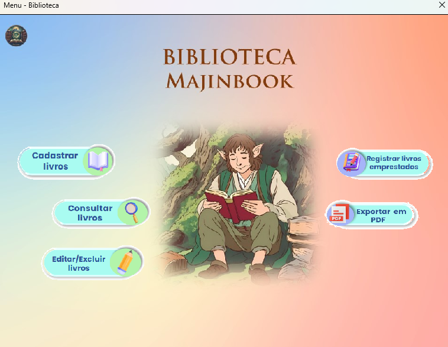
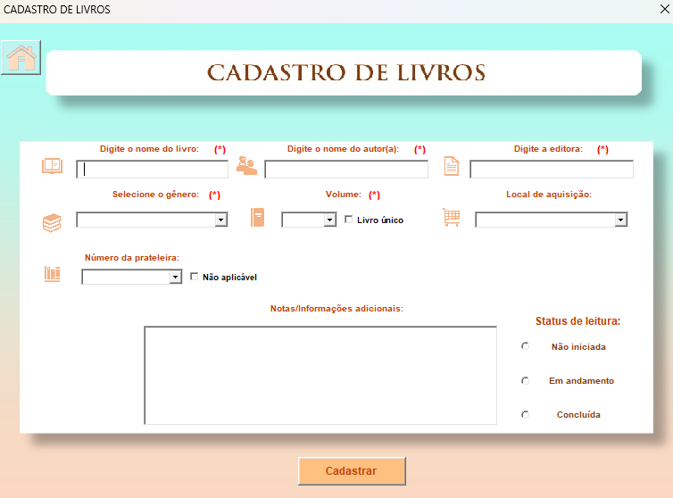
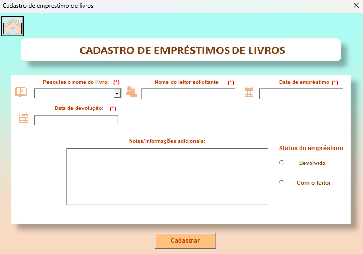
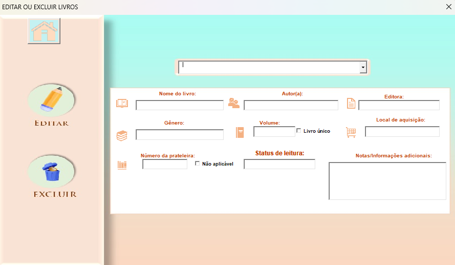
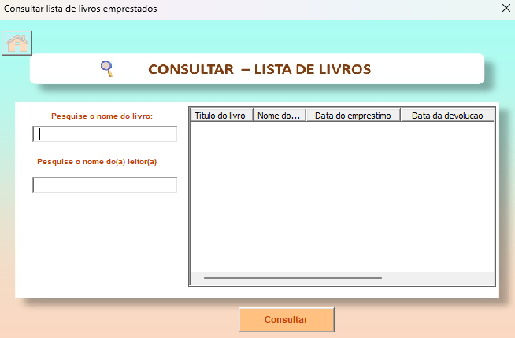
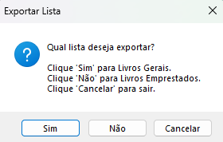

# 📚 Biblioteca - Majinbook 📚

# 📝Introdução 

 O projeto foi desenvolvido com o objetivo de facilitar a organização de nossa coleção de livros, além de permitir o controle de empréstimos. Trata-se de uma iniciativa voltada para fins de estudo e aprimoramento na linguagem de programação utilizada 

- Foi utilizado a linguagem VBA
- Layouts utilizados no projeto disponíveis na pasta de img em arquivo .PPT

# 🛠️ Como executar o projeto?
- Para executar o projeto, basta realizar o download do arquivo .xlsx já habilitado para macros.

# 🖥️ Funcionalidades disponíveis

- Menu

- Cadastro de livros gerais

- Cadastro de livros emprestados

- Edição/Exclusão de livros gerais e emprestados

- Visualização da listagem dos livros gerais e emprestados

- Exportação das planilhas em PDF

